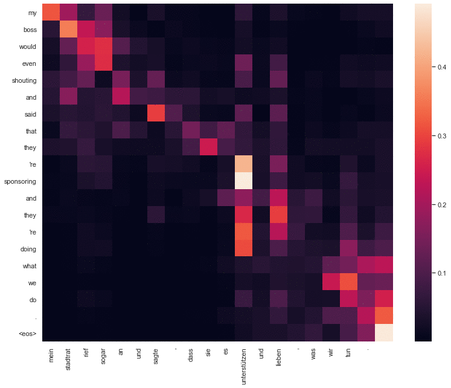
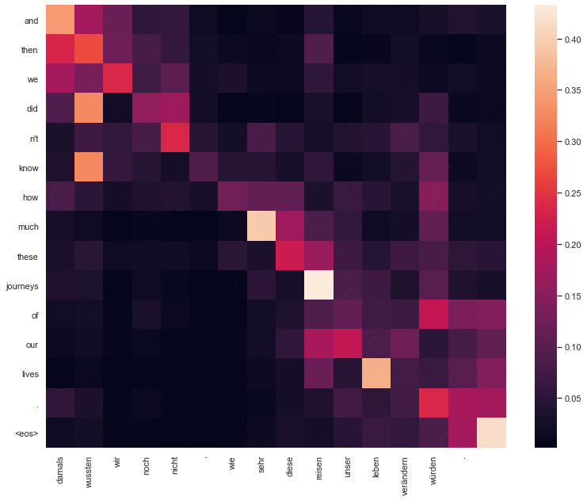
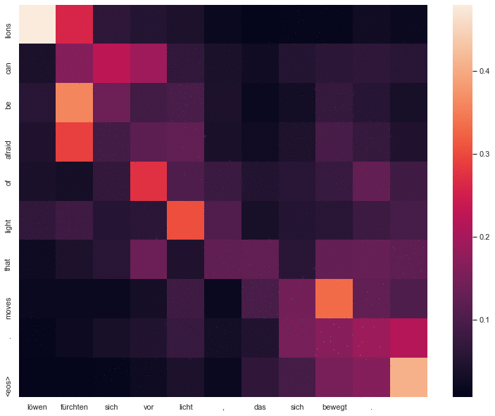

Attention Weights Comparison
==============================

In this project, I tried to compare Bahdanau attention against Transformer's attention. To do that, I trained a Transformer model and a GRU based encoder decoder that uses Bahdanau attention on the same dataset, with roughly the same network size, and same number of epochs. Using these trained models, I compared attention weights produced by them for the same input sentence.

Needless to say that the Transformer performed slighly better than the RNN model, but it could've performer even better if it wasn't for the limitation in its hyperparameters (1 layer, 1 attention head).

The hyperparameters were constrained so a proper comparision in attention weights would be possible. It would be hard for example to see the difference between the attention weights of the two models if the Transformer had more than one attention head, or if it had more than one layer. You can take a look at the hyper-parameters in `config.yaml`.

In the notebooks folder, I included notebooks that go through the training of the two models step by step. 

# <b> Example results: </b>

<h3><b>Notes</b></h3> All letters are lowercase. The quality of the translation is not the best since the models and the dataset (IWSLT) are relatively small. This is merely done for the sake of comparison.

All of these examples are available in the notebook: `notebooks/Comparison.ipynb`. You are welcome to try your own examples. You don't need to train the models, they are already trained in `models/*`

&nbsp;

<b>Source </b>: min stadtrat rief sogar an und sagte , dass sie es unterstützen und lieben , was wir tun. 

Bahdanau RNN translation: my hometown of even said , and said that it's about it, and you know what we do. (First image)

Transformer translation: my boss would even shouting and said that they're sponsoring and they're doing what we do. (Second image)

<b>Expected translation </b>: my councilman even called in and said how they endorse and love what we 're doing .

&nbsp;

<b>Source </b>: damals wussten wir noch nicht , wie sehr diese reisen unser leben verändern würden . 

Bahdanau RNN translation: we didn't even know how much these things were going to change our lives. (First image)

Transformer translation: and then we didn't know how much these journeys of our lives. (Second image)

<b>Expected translation </b>: back then , we had no idea how much this trip would change our lives .

&nbsp;

<b>Source </b>: löwen fürchten sich vor licht , das sich bewegt . 

Bahdanau RNN translation: lions fear of light, that moves. <unk\> . (First image)

Transformer translation: lions can be afraid of light that moves. (Second image)

<b>Expected translation </b>: and i discovered that lions are afraid of a moving light .

----

To train the model, and run the code on your computer:

    1. Clone the code
    2. py download_dataset.py  #Download the dataset (original link doesn't work)
    3. py train-bahdanau-translator.py  #(Train the RNN model)
    4. py train-transformer-translator.py #(Train the Transformer)
    5. Open Comparison.ipynb to visualize attention weights and compare translations

You can take a look at the training code either in a jupyter notebook, or under `src/*` in a python file. Use the file `config.yaml` to configure the size of the model, and the hyper-paramters of both models.

Hope you find this interesting!